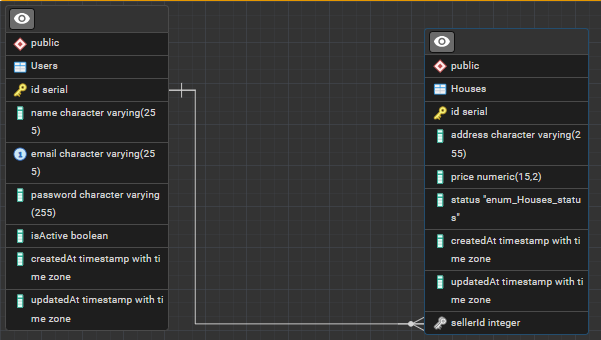

# Inmueble INC - Plataforma de Gestión de Inmuebles

Esta es una app Fullstack de gestion de inmuebles, solicitada para la prueba tecnica de KS2, con un buen diseño y experiencia de usuario. El frontend se desarrollo con React y Tailwind CSS, y el backend con Node.js con y PostgreSQL.
## Requisitos del Sistema

- **Node.js**: v16+ (Recomendado v18 o superior)
- **PostgreSQL**: v12+ instalado y ejecutándose localmente. Tambien podria montarse en un contenedor docker o un servidor de Supabase, pero solo para tener la base de datos.
. La base de datos solo tiene 2 tablas, una para usuarios y otra para inmuebles, con algunas relaciones entre ellas, como se ve en la imagen. La relacion entre las tablas es de uno a muchos, es decir, un usuario puede tener muchos inmuebles, como se habia solicitado en la especificacion de la prueba.
## Configuración y Ejecución

### 1. Base de Datos
- Crea una base de datos en tu servidor PostgreSQL local llamada `real_estate_management`.
- Alternativamente, puedes usar PgAdmin o la línea de comandos de psql:
  ```sql
  CREATE DATABASE real_estate_management;
  ```

### 2. Backend
1. Navega a la carpeta del servidor:
   ```bash
   cd backend
   ```
2. Instala las dependencias:
   ```bash
   npm install
   ```
3. Configura el entorno:
   Revisa el archivo `backend/.env` y asegúrate de que las credenciales (`DB_USER`, `DB_PASSWORD`, `DB_HOST`, `DB_PORT`) coincidan con tu configuración local de PostgreSQL. En mi caso use una base de datos local, con los datos especificados en el archivo `.env`, usted deberia correrlo creando su propia base de datos y actualizando los datos en el archivo `.env`, dependiedo de su configuración local.
   
4. Inicia el servidor de desarrollo:
   nos iremos a la carpeta backend y ejecutamos el comando:
   ```bash
   npm run dev
   ```
   *El servidor se iniciará en `http://localhost:5000` y sincronizará automáticamente las tablas en la base de datos.*

### 3. Frontend
1. Abre otra terminal y asegúrate de estar en la raíz del proyecto.
2. Navega a la carpeta del frontend:
   ```bash
   cd frontend
   ```
3. Instala las dependencias:
   ```bash
   npm install
   ```
4. Inicia la aplicación React:
   ```bash
   npm run dev
   ```
   *El frontend estará disponible en `http://localhost:5173`.*

## Credenciales de Prueba

Si usted no esta registrado en la base de datos que usa la aplicacion, entonces debera crear su usario donde podrar correr la aplicacion.
Los datos que use para crearse en la base de datos seran los que use para iniciar sesion. 
Puede usar correos random de un generador de correos randoms si no quiere usar sus propias credenciales. 

## Características
A grandes rasgos la aplicacion tiene las siguientes funcionalidades:
- Se puede ver la lista de inmuebles, con su descripcion
- Se puede buscar, filtrar por estado, editar, eliminar y agregar nuevas ventas.
- Se puede ver la lista de usuarios, con su correo y rol.
- Se tiene un control de permisos, donde solo los usuarios con rol de administrador pueden eliminar y editar los inmuebles y usuarios, y los usuarios con rol de editor pueden editar y eliminar los inmuebles.
